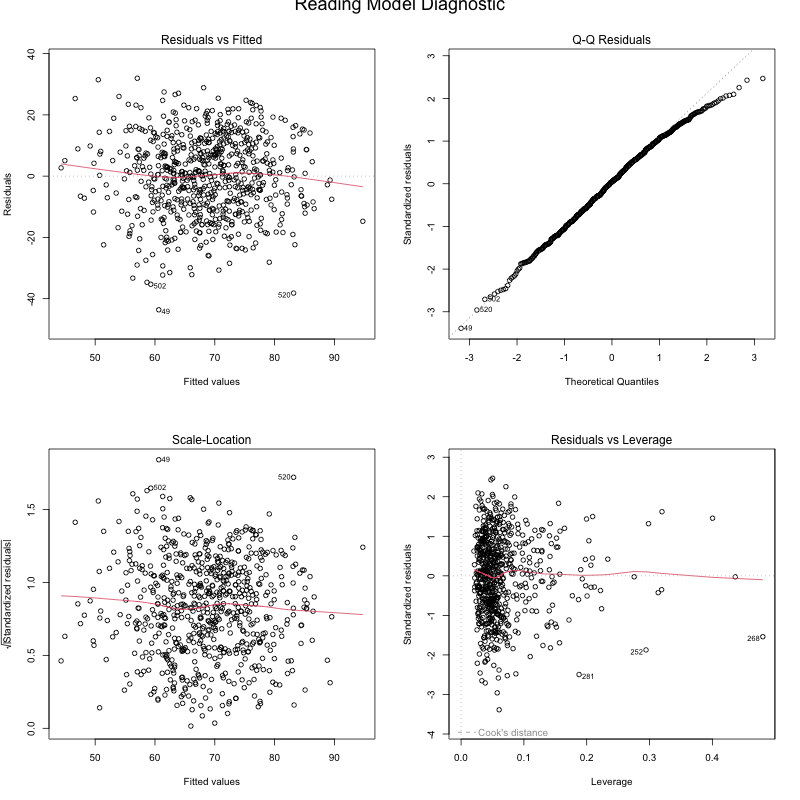

\setstretch{2}  

# Abstract

a brief introduction, brief description of methods, and main results into a one-paragraph summary

# Introduction

brief context and background of the problem

# Methods (data description and statistical methods)

## Missing Value Treatment:

Minimal missing values were observed as figure 1, primarily in qualitative variables such as EthnicGroup, ParentEduc, TestPrep, and others. Mode imputation was used for all except TransportMeans, with samples still showing missing values after imputation excluded. 

## Model Selection:

### LASSO(Least Absolute Shrinkage and Selection Operator)

LASSO ($\min_{\beta} \left( \frac{1}{N} \sum_{i=1}^{N} (y_i - \beta_0 - \sum_{j=1}^{p} x_{ij} \beta_j)^2 + \lambda \sum_{j=1}^{p} |\beta_j| \right)$), introduced by Robert Tibshirani in 1996, is a regression method that enhances model accuracy and interpretability by performing variable selection and regularization. Ideal for models with numerous predictors or high collinearity, LASSO shrinks some coefficients to zero, thus simplifying the model by penalizing the sum of absolute parameter values.

## Model Assessment:

### Cook's Distance (Residual vs Leverage Plot)

Cook's Distance($D_i = \frac{\sum_{j=1}^{n} (\hat{Y}_j - \hat{Y}_{j(i)})^2}{p MSE}.$), combined with the Residual vs. Leverage Plot, identifies influential observations in regression models. It measures each observation's impact on the fitted values to highlight potential outliers.


### VIF (Variance Inflation Factor)

Adjusted Generalized Variance Inflation Factor (${GVIF}^{(1 / (2 \times Df))} = \left( \frac{1}{1 - R^2_j} \right)^{(1 / (2 \times {Df}_j))}.$ ) was used instead of traditional VIF to assess multicollinearity, especially suitable for categorical variables and models with interaction terms.

An adjusted GVIF value ranging from 1 to 3 indicates no significant issues, while values exceeding 5 or 10 suggest notable multicollinearity. 

## Model Validation:

### 10-fold Cross Validation

A 10-fold cross-validation approach was employed. This method involves partitioning the data into 10 subsets, using 9 for training and 1 for validation in a rotating fashion. This process is repeated until each subset has been used for validation.

### The Mean Squared Prediction Errors (MSPE)

The Mean Squared Prediction Error (${MSPE} = \frac{1}{n} \sum_{i=1}^{n} (y_i - \hat{y}_i)^2.$) is a statistical measure used to evaluate the accuracy of a predictive model. It calculates the average of the squares of the prediction errors, where a prediction error is the difference between the observed values and the predicted values made by the model. 

# Results

描述性统计部分结果。+After missing value treatment, we left 846 samples for further analysis. 

相关性部分结果。

To facilitate internal validity assessment in subsequent modeling, the data was split into a training set (80%) and a test set (20%).

Despite the lack of evident correlations among variables, interaction terms were included in the full models based on theoretical and practical considerations. These models encompassed all 11 predictors with their pairwise interactions, aiming to further simplify the variable subset to mitigate overfitting risks.

Utilizing a combination of automated methods and criteria-based selection, the model refinement process began with backward elimination guided by the AIC criterion, which favored fewer variables. However, this approach initially retained too many variables. Consequently, we employed LASSO penalization, complemented by cross-validation to determine the optimal lambda. This led to the removal of interaction terms with shrinkage coefficients under 0.5, yielding three more efficient, nested models. (see in appendix)

Diagnostic plots for these models indicate no issues.

Examination of the residual vs leverage plots for the three models revealed a few outlier observations, notably in samples 181 and 268 according to figure 2. However, closer inspection showed that their leverage did not exceed 0.5, and Cook's distances were below 0.1. Additionally, no data entry anomalies were identified in these samples. Removing these samples and reconstructing the models showed negligible differences from the original models. Therefore, no adjustments were made, and the original data was used for modeling.

As for the multicollinearity check, we found no substantial multicollinearity concerns in any of the model variables.

The cross-validation results indicated that the RMSE for the Math model was concentrated around 12, while for the Reading and Writing models, RMSE values were centered around 12.5, according to figure 3. To test for potential overfitting, the initially separated test data was employed to evaluate the predictive performance of the models. The Mean Squared Prediction Errors (MSPE) for the Math, Reading, and Writing models were 198.3466, 152.9267, and 142.8281, respectively. Contrary to the RMSE results, the Math model exhibited a lower performance compared to the Reading and Writing models. Given that the Math model incorporated the most predictors, it suggests a potential issue with overfitting.

# Conclusions/Discussion

Your content here. 

# A brief summary on each group member’s contribution

Your content here. 

\newpage

# Figures

```{r, echo=FALSE, fig.cap="Ys' distribution", out.width='6in'}
knitr::include_graphics("Y'distribution.png")
```


```{r, echo=FALSE, fig.cap="Ys' correlation", out.width='6in'}
knitr::include_graphics("Y's correlation.png")
```
```{r, echo=FALSE, fig.cap="pairwise", out.width='6in'}

```

```{r, echo=FALSE, fig.cap="missingdata"}
knitr::include_graphics("Missingdata.png")
```

```{r, echo=FALSE, fig.cap="math", out.width='7in'}
knitr::include_graphics("math.png")
```

```{r, echo=FALSE, fig.cap="reading", out.width='7in'}

```

```{r, echo=FALSE, fig.cap="writing", out.width='7in'}

```

```{r, echo=FALSE, fig.cap="Cook's Distance", out.width='8in'}

```

```{r, echo=FALSE, fig.cap="CV outcome"}
knitr::include_graphics("cv.png")
```

\newpage

# Tables

```{r table-mspe_values, echo=FALSE}
mspe_values <- data.frame(
  Subject = c("Math", "Reading", "Writing"),
  MSPE = c(198.3466, 152.9267, 142.828)
)
knitr::kable(mspe_values, col.names = c("Subject", "MSPE"), caption = "MSPE Values for Different Subjects")
```

```{r table-math, echo=FALSE}
#| echo: false
#| message: false
library(dplyr)
# Your provided data frames
vif_values_math <- data.frame(
  Predictor = c("Gender", "EthnicGroup", "ParentEduc", "LunchType", "TestPrep", "ParentMaritalStatus",
                "PracticeSport", "TransportMeans", "WklyStudyHours"),
  GVIF = c(1.655040, 1.353349, 1.081339, 1.643025, 1.074470, 1.331176, 1.357566, 1.516250, 1.366449)
)


knitr::kable(vif_values_math, caption = "Variance Inflation Factors for Math Model", 
      col.names = c("Predictor", "GVIF"), 
      format = "latex", booktabs = TRUE)

```

```{r table-writing, echo=FALSE}
vif_values_writing <- data.frame(
  Predictor = c("Gender", "EthnicGroup", "ParentEduc", "LunchType", "TestPrep", "ParentMaritalStatus",
                "PracticeSport", "IsFirstChild", "NrSiblings", "TransportMeans", "WklyStudyHours"),
  GVIF = c(1.042331, 1.041528, 1.157013, 1.659319, 1.040662, 1.183376, 1.200553, 1.339793, 1.040662, 
           1.034014, 1.413038)
)
# Writing Model VIF Values
knitr::kable(vif_values_writing, caption = "Variance Inflation Factors for Writing Model", 
      col.names = c("Predictor", "GVIF"), 
      format = "latex", booktabs = TRUE)
```

```{r table-reading, echo=FALSE}
vif_values_reading <- data.frame(
  Predictor = c("Gender", "EthnicGroup", "ParentEduc", "LunchType", "TestPrep", "ParentMaritalStatus",
                "PracticeSport", "IsFirstChild", "NrSiblings", "TransportMeans", "WklyStudyHours"),
  GVIF = c(1.036102, 1.039638, 1.032325, 1.648075, 1.044683, 1.117825, 1.199588, 1.619041, 1.608364, 
           1.034064, 1.255155)
)
# Reading Model VIF Values
knitr::kable(vif_values_reading, caption = "Variance Inflation Factors for Reading Model", 
      col.names = c("Predictor", "GVIF"), 
      format = "latex", booktabs = TRUE)
```


\newpage

# References

Bollinger, G. (1981). Book Review: Regression Diagnostics: Identifying Influential Data and Sources of Collinearity. Journal of Marketing Research, 18(3), 392-393. https://doi.org/10.1177/002224378101800318

Fox, J., & Monette, G. (1992). Generalized Collinearity Diagnostics. Journal of the American Statistical Association, 87(417), 178-183. https://doi.org/10.2307/2290467

Tibshirani, R. (1996). Regression shrinkage and selection via the Lasso. Journal of the Royal Statistical Society. Series B (Methodological), 58(1), 267-288.

Hyndman, R. J., & Athanasopoulos, G. (2018). Forecasting: Principles and Practice (2nd ed.). OTexts.


\newpage

# Appendix

## Three final regression models-看要不要加有coefficient的版本

`MathScore ~  Gender + EthnicGroup + ParentEduc + LunchType + TestPrep + ParentMaritalStatus + PracticeSport + TransportMeans + WklyStudyHours + Gender:PracticeSport + EthnicGroup:ParentEduc + ParentEduc:ParentMaritalStatus + + ParentEduc:PracticeSport + LunchType:PracticeSport + ParentMaritalStatus:TransportMeans + PracticeSport:WklyStudyHours`

`ReadingScore ~ Gender + EthnicGroup + ParentEduc + LunchType + TestPrep + ParentMaritalStatus + PracticeSport + IsFirstChild + NrSiblings + TransportMeans + WklyStudyHours + LunchType:PracticeSport + ParentMaritalStatus:PracticeSport + ParentMaritalStatus:IsFirstChild + PracticeSport:WklyStudyHours + NrSiblings:WklyStudyHours`

`WritingScore ~ Gender + EthnicGroup + ParentEduc + LunchType + TestPrep + ParentMaritalStatus + PracticeSport + IsFirstChild + NrSiblings + TransportMeans + WklyStudyHours + ParentEduc:IsFirstChild + LunchType:PracticeSport + TestPrep:NrSiblings + ParentMaritalStatus:PracticeSport + ParentMaritalStatus:IsFirstChild + PracticeSport:WklyStudyHours + IsFirstChild:WklyStudyHours`

