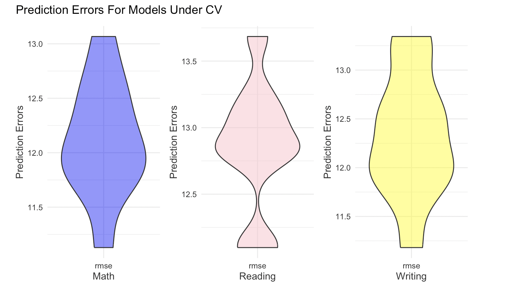

\setstretch{2}  

# Abstract

a brief introduction, brief description of methods, and main results into a one-paragraph summary

# Introduction

This project is based on a dataset which includes three test scores (math, reading and writing) of students at a public school and a variety of personal and socio-economic factors that may have interaction effects upon them. We want to use these factors as the covariates to predict Math, Reading and Writing scores.

# Methods (data description and statistical methods)

## Data Description and Visualization

There are a total of 14 variables(including 3 response variables[12-14] and 11 predictor variables[1-11]) with 948 observations in this dataset. The 11 predictor variables[1-11] are categorical variables and the 3 response variables[12-14] are continuous variables. The 3 response variables all have a relatively symmetric distributions with several outliers.(See figure 1)

## Correlation between varibales

We use the following methods to assess the strength of correlation: For categorical vs categorical variables, we use Cramer's V correlation. For continuous vs continuous variables, we use Pearson correlation. For categorical vs continuous variables, we use ANOVA(mcor). The correlation coefficients between variables all vary from 0 (corresponding to no association between the variables) to 1 (complete association) and can reach 1 only when each variable is completely determined by the other.

## Missing Value Treatment:

Minimal missing values were observed as figure 5, primarily in qualitative variables such as EthnicGroup, ParentEduc, TestPrep, and others. Mode imputation was used for all except TransportMeans, with samples still showing missing values after imputation excluded. 

## Model Selection:

Interaction terms were included in the full models, despite limited variable correlations, for theoretical and practical reasons, covering all 11 predictors and their interactions to reduce overfitting. Model refinement began with AIC-guided backward elimination, but to address the retention of excessive variables, we applied LASSO penalization with cross-validation for optimal lambda selection. This process eliminated interaction terms with shrinkage coefficients below 0.5, resulting in three more streamlined, nested models (detailed in the appendix).

## Model Assessment:

We utilized various diagnostic plots, including residual vs. fitted, Q-Q plots, scale-location, and residuals vs. leverage, to check whether our model meets the assumptions. We also computed Cook's Distance to identify any influential observations. Furthermore, to assess the presence of multicollinearity issues, we calculated the model's adjusted Generalized Variance Inflation Factor (GVIF).

## Model Validation:

We employed a 10-fold cross-validation approach, which involved systematically partitioning the data into 10 subsets. In each cycle of this method, 9 subsets were used for training the model while the remaining one served as the validation set. This rotation continued until each subset had been utilized for validation, ensuring a comprehensive assessment of the model's performance. Additionally, to evaluate the predictive accuracy of our models, we calculated the Mean Squared Prediction Error (MSPE) using separate test data.

# Results

There are a total of 14 variables(including 3 response, continuouse variables[12-14] and 11 predictor, categorical variables[1-11]) with 948 observations in this dataset. After missing value treatment, we left 846 obserbvations for further analysis. The 3 response variables all have a relatively symmetric distributions with several outliers.

There is no colinearities exist between response variables and explanatory variables(See figure 3), and within 11 explanatory variables(See figure 4). However, there is a high correlation between the 3 response variables.Each explanatory are correlated with the other two with a correlation coefficient higher than 0.8.

Data was split into 80% training and 20% test sets for validity assessment. Diagnostic plots (figures 6-8) show no major issues. Residual vs. leverage plots (figure 9) identified outliers, especially in samples 181 and 268, but with leverage under 0.5 and Cook's distances below 0.1, leading to no data adjustments. Multicollinearity checks revealed no significant concerns.

Cross-validation results indicated RMSEs around 12 for the Math model and 12.5 for Reading and Writing (figure 10). MSPEs were 198.3466, 152.9267, and 142.8281, respectively, suggesting potential overfitting in the Math model due to its numerous predictors.

Finally, we dive deep into our model and related the statistical results to the initial problem in real world. Here are some important and interesting findings:  In all three models, the impact of gender on scores is very significant, specifically reflected in the fact that males perform better in math compared to females, while their reading and writing scores are lower than females. Students who did not participate in test preparation significantly scored lower in math, while students who enjoy standard lunch types and sometimes practice in sports significantly at the same time scored higher. Futhermore, ethnical Group D performing notably better. Whether taking the school bus and the duration of study also have certain impacts on some scores. Students who are firstborn significantly outperform those who are not the firstborn in reading and writing. The presence and number of siblings also have some impact on the scores, but the changes are not substantial. The lower the parents' education level, the significantly lower the children's reading and writing scores are. Surprisingly, parents' marital status has a significant change in scores. In the math score model, students with widowed parents can actually increase their scores by 32 points! (p-value = 0.019).

# Conclusions/Discussion

Your content here. 

# A brief summary on each group member’s contribution

Eunice Wang (cw3555) focused on initial data analysis and exploring relationships. Aiying Huang (ah4167) contributed to model construction, validation, and final report structuring. Mia Yu (my2838) was key in model selection and diagnostics, while all team members jointly wrote the report's introduction and conclusion.

\newpage

# Figures and Tables

```{r, echo=FALSE, fig.cap="Ys' distribution", out.width='6in', fig.pos="H"}
knitr::include_graphics("Y'distribution.png")
```

```{r, echo=FALSE, fig.cap="Ys' correlation", out.width='6in', fig.pos="H"}
knitr::include_graphics("Y's correlation.png")
```

```{r, echo=FALSE, fig.cap="pairwise", out.width='6in', fig.pos="H"}
knitr::include_graphics("pairwise.png")
```

```{r, echo=FALSE, fig.cap="heatmap", out.width='6in', fig.pos="H"}

```

```{r, echo=FALSE, fig.cap="missingdata", fig.pos="H"}
knitr::include_graphics("Missingdata.png")
```

```{r, echo=FALSE, fig.cap="math", out.width='7in', fig.pos="H"}

```

```{r, echo=FALSE, fig.cap="reading", out.width='7in', fig.pos="H"}
knitr::include_graphics("reading.png")
```

```{r, echo=FALSE, fig.cap="writing", out.width='7in', fig.pos="H"}
knitr::include_graphics("writing.png")
```

```{r, echo=FALSE, fig.cap="Cook's Distance", out.width='8in', fig.pos="H"}
knitr::include_graphics("cookdistance.png")
```

```{r, echo=FALSE, fig.cap="CV outcome", out.width='8in', fig.pos="H"}

```

```{r table-mspe_values, echo=FALSE}
mspe_values <- data.frame(
  Subject = c("Math", "Reading", "Writing"),
  MSPE = c(198.3466, 152.9267, 142.828)
)
knitr::kable(mspe_values, col.names = c("Subject", "MSPE"), caption = "MSPE Values for Different Subjects")
```

```{r table-math, echo=FALSE}
#| echo: false
#| message: false
library(dplyr)
# Your provided data frames
vif_values_math <- data.frame(
  Predictor = c("Gender", "EthnicGroup", "ParentEduc", "LunchType", "TestPrep", "ParentMaritalStatus",
                "PracticeSport", "TransportMeans", "WklyStudyHours"),
  GVIF = c(1.655040, 1.353349, 1.081339, 1.643025, 1.074470, 1.331176, 1.357566, 1.516250, 1.366449)
)


knitr::kable(vif_values_math, caption = "Variance Inflation Factors for Math Model", 
      col.names = c("Predictor", "GVIF"), 
      format = "latex", booktabs = TRUE)

```

```{r table-writing, echo=FALSE}
vif_values_writing <- data.frame(
  Predictor = c("Gender", "EthnicGroup", "ParentEduc", "LunchType", "TestPrep", "ParentMaritalStatus",
                "PracticeSport", "IsFirstChild", "NrSiblings", "TransportMeans", "WklyStudyHours"),
  GVIF = c(1.042331, 1.041528, 1.157013, 1.659319, 1.040662, 1.183376, 1.200553, 1.339793, 1.040662, 
           1.034014, 1.413038)
)
# Writing Model VIF Values
knitr::kable(vif_values_writing, caption = "Variance Inflation Factors for Writing Model", 
      col.names = c("Predictor", "GVIF"), 
      format = "latex", booktabs = TRUE)
```

```{r table-reading, echo=FALSE}
vif_values_reading <- data.frame(
  Predictor = c("Gender", "EthnicGroup", "ParentEduc", "LunchType", "TestPrep", "ParentMaritalStatus",
                "PracticeSport", "IsFirstChild", "NrSiblings", "TransportMeans", "WklyStudyHours"),
  GVIF = c(1.036102, 1.039638, 1.032325, 1.648075, 1.044683, 1.117825, 1.199588, 1.619041, 1.608364, 
           1.034064, 1.255155)
)
# Reading Model VIF Values
knitr::kable(vif_values_reading, caption = "Variance Inflation Factors for Reading Model", 
      col.names = c("Predictor", "GVIF"), 
      format = "latex", booktabs = TRUE)
```


\newpage

# References

Bollinger, G. (1981). Book Review: Regression Diagnostics: Identifying Influential Data and Sources of Collinearity. Journal of Marketing Research, 18(3), 392-393. https://doi.org/10.1177/002224378101800318

Fox, J., & Monette, G. (1992). Generalized Collinearity Diagnostics. Journal of the American Statistical Association, 87(417), 178-183. https://doi.org/10.2307/2290467

Tibshirani, R. (1996). Regression shrinkage and selection via the Lasso. Journal of the Royal Statistical Society. Series B (Methodological), 58(1), 267-288.

Hyndman, R. J., & Athanasopoulos, G. (2018). Forecasting: Principles and Practice (2nd ed.).OTexts.

\newpage

# Appendix

## Three final regression models

`MathScore ~  Gender + EthnicGroup + ParentEduc + LunchType + TestPrep + ParentMaritalStatus + PracticeSport + TransportMeans + WklyStudyHours + Gender:PracticeSport + EthnicGroup:ParentEduc + ParentEduc:ParentMaritalStatus + + ParentEduc:PracticeSport + LunchType:PracticeSport + ParentMaritalStatus:TransportMeans + PracticeSport:WklyStudyHours`

`ReadingScore ~ Gender + EthnicGroup + ParentEduc + LunchType + TestPrep + ParentMaritalStatus + PracticeSport + IsFirstChild + NrSiblings + TransportMeans + WklyStudyHours + LunchType:PracticeSport + ParentMaritalStatus:PracticeSport + ParentMaritalStatus:IsFirstChild + PracticeSport:WklyStudyHours + NrSiblings:WklyStudyHours`

`WritingScore ~ Gender + EthnicGroup + ParentEduc + LunchType + TestPrep + ParentMaritalStatus + PracticeSport + IsFirstChild + NrSiblings + TransportMeans + WklyStudyHours + ParentEduc:IsFirstChild + LunchType:PracticeSport + TestPrep:NrSiblings + ParentMaritalStatus:PracticeSport + ParentMaritalStatus:IsFirstChild + PracticeSport:WklyStudyHours + IsFirstChild:WklyStudyHours`


1. Gender: Gender of the student (male/female)

2. EthnicGroup: Ethnic group of the student (group A to E)

3. ParentEduc: Parent(s) education background (from some_highschool to master's degree)

4. LunchType: School lunch type (standard or free/reduced)

5. TestPrep: Test preparation course followed (completed or none)

6. ParentMaritalStatus: Parent(s) marital status (married/single/widowed/divorced)

7. PracticeSport: How often the student parctice sport (never/sometimes/regularly))

8. IsFirstChild: If the child is first child in the family or not (yes/no)

9. NrSiblings: Number of siblings the student has (0 to 7)

10. TransportMeans: Means of transport to school (schoolbus/private)

11. WklyStudyHours: Weekly self-study hours(less that 5hrs; between 5 and 10hrs; more than 10hrs)

12. MathScore: math test score(0-100)

13. ReadingScore: reading test score(0-100)

14. WritingScore: writing test score(0-100)

```{r, echo=FALSE}
readRDS("math_table.rds") |>
  lapply(function(x) if(is.numeric(x)) round(x, 3) else x) |>
  data.frame() |>
  knitr::kable(caption = "Math Model Coefficients") 
```

\newpage

```{r, echo = FALSE}
readRDS("reading_table.rds") |>
  lapply(function(x) if(is.numeric(x)) round(x, 3) else x) |>
  data.frame() |>
  knitr::kable(caption = "Reading Model Coefficients") 
```

\newpage

```{r, echo=FALSE}
readRDS("writing_table.rds") |>
  lapply(function(x) if(is.numeric(x)) round(x, 3) else x) |>
  data.frame() |>
  knitr::kable(caption = "Writing Model Coefficients") 
```